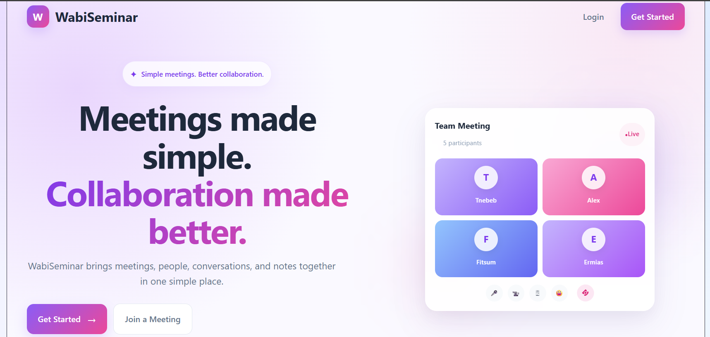
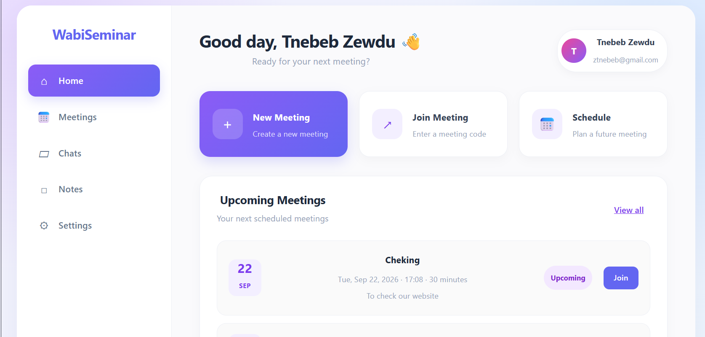
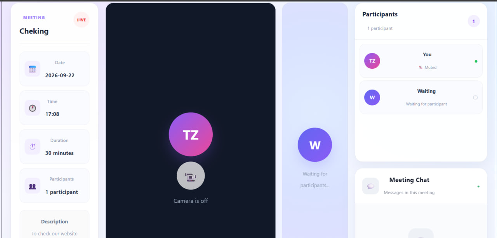
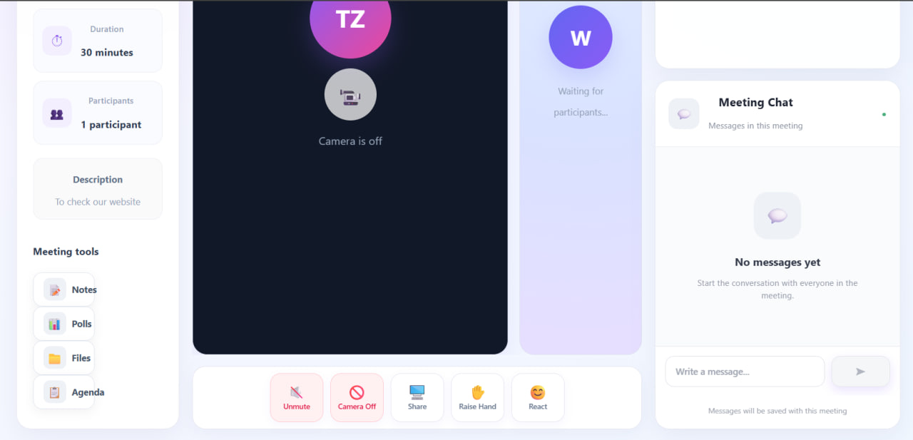

# WabiSeminar

### Online Seminar & Meeting Platform

**Team Project · Frontend Developer**

WabiSeminar is an online seminar and meeting platform designed to bring meetings, participants, conversations, notes, and collaboration tools into one place.

## Overview

WabiSeminar provides a centralized environment for creating, joining, and managing online meetings.

The platform includes a dashboard for managing meetings and a dedicated meeting-room experience with participant management, communication, and collaboration tools.

## Features

- User authentication
- Meeting creation and management
- Join meetings using a meeting code
- Meeting dashboard
- Participant management
- Meeting room interface
- Microphone and camera controls
- Screen sharing
- Raise hand
- Participant reactions
- Meeting chat
- Meeting notes
- Polls
- Agenda management
- File-related collaboration
- Meeting notifications
- User settings

## My Contribution

### Frontend Developer

WabiSeminar was developed as a team project. My primary responsibility was frontend development.

I contributed to:

- Building React-based user interfaces
- Developing the meetings interface
- Implementing the meeting-room experience
- Creating participant and meeting controls
- Building UI for chat and collaboration features
- Implementing notes, polls, files, and agenda interfaces
- Connecting frontend components with backend APIs
- Improving navigation, layout, responsiveness, and usability

## Tech Stack

### Frontend

- React
- Vite
- React Router
- JavaScript
- CSS

### Backend

- Node.js
- Express
- MySQL
- JWT
- bcrypt
- Multer

## Screenshots

### Landing Page



### Dashboard



### Meeting Room



### Meeting Room Collaboration Tools



## Project Structure

This branch contains the frontend implementation of WabiSeminar.

```text
WabiSeminar/
├── frontend/
│   ├── src/
│   │   ├── components/
│   │   ├── pages/
│   │   └── ...
│   ├── package.json
│   └── ...
│
├── screenshots/
│   ├── landing.png
│   ├── dashboard.png
│   ├── meeting-room.png
│   └── meeting-room-tools.png
│
└── README.md
```

The `frontend/` directory contains the React-based user interface, while `screenshots/` contains project screenshots used in this README.

This branch focuses on my frontend contribution to the WabiSeminar team project.


## Getting Started

### Prerequisites

* Node.js
* npm

### Installation

Clone the repository:

```bash
git clone <repository-url>
cd WabiSeminar
```

Install frontend dependencies:

```bash
cd frontend
npm install
```

### Run the Frontend

Start the frontend development server using the project's configured npm script.

```bash
npm run dev
```

> The backend is maintained separately by the team on the appropriate project branch.

## Team Project

WabiSeminar was developed collaboratively as a team project.

My primary contribution focused on frontend development and user experience, particularly the meetings and meeting-room interfaces.

## Future Improvements

* Improve responsive behavior across additional screen sizes
* Add automated frontend testing
* Improve accessibility
* Improve production deployment
* Expand real-time collaboration capabilities

